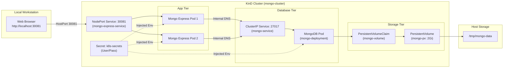

# Kubernetes MongoDB & Mongo Express Stack

[](https://kubernetes.io/)
[](https://kind.sigs.k8s.io/)
[](https://www.mongodb.com/)
[](https://github.com/mongo-express/mongo-express)

A production-style local Kubernetes development setup deploying a secured **MongoDB** instance with persistent volume storage and a scalable **Mongo Express** administrative web dashboard, orchestrated on a **KinD (Kubernetes in Docker)** cluster.

---

## Table of Contents

- [Overview](#overview)
- [Architecture](#architecture)
- [Key Features](#key-features)
- [Project Structure](#project-structure)
- [Prerequisites](#prerequisites)
- [Quick Start](#quick-start)
- [Manual Step-by-Step Deployment](#manual-step-by-step-deployment)
- [Access & Credentials](#access--credentials)
- [Verification & Health Checks](#verification--health-checks)
- [Teardown & Cleanup](#teardown--cleanup)
- [Support](#support)
- [Contributing](#contributing)

---

## Overview

This repository provides declarative Kubernetes manifests and automation scripts to run a two-tier database and management application locally:

- **MongoDB**: A single-replica stateful database deployment backed by a Kubernetes `PersistentVolume` (`hostPath`) and `PersistentVolumeClaim`.
- **Mongo Express**: A 2-replica web-based administrative interface exposed through a `NodePort` service, mapped directly to host port `30081` via KinD port-mapping.
- **Security**: Centralized credential management using Kubernetes `Secret` resources for both database authentication and web UI basic auth.

---

## Architecture



---

## Key Features

- **Automated Cluster & Stack Provisioning**: Single-script deployment via [`run.sh`](run.sh) handling cluster creation, manifest application, and pod readiness checks.
- **Persistent Data Storage**: Uses a dedicated `PersistentVolume` mapped to `/tmp/mongo-data`, ensuring database records persist across pod restarts and deployments.
- **High Availability Web Dashboard**: Multi-replica (2 pods) Mongo Express frontend with internal load balancing.
- **Integrated Port Forwarding**: KinD control-plane extra port mapping routes port `30081` seamlessly from host to node without requiring `kubectl port-forward`.
- **Resource Constraints**: Defined CPU and memory requests (`250m`, `512Mi`) and limits (`500m`, `1Gi`) for deterministic performance.

---

## Project Structure

```text
.
├── k8s/
│   ├── k8s-cluster.yaml            # KinD cluster spec with port 30081 mapping
│   ├── k8s-secrets.yaml            # Kubernetes Secret containing authentication credentials
│   ├── app/
│   │   ├── mongo-express-app.yaml     # Mongo Express Deployment (2 replicas)
│   │   └── mongo-express-service.yaml # NodePort Service exposing Mongo Express
│   ├── database/
│   │   ├── mongo-app.yaml             # MongoDB Deployment with volume mount
│   │   └── mongo-service.yaml         # Internal ClusterIP Service for MongoDB
│   └── volume/
│       ├── mongo-volume.yaml          # PersistentVolume specification (2Gi hostPath)
│       └── mongo-volume-claim.yaml    # PersistentVolumeClaim for MongoDB
├── run.sh                          # One-click bootstrap and verification script
└── README.md                       # Project documentation
```

---

## Prerequisites

Ensure you have the following CLI tools installed and running on your system:

| Tool        | Minimum Version | Installation Link                                                                         |
| :---------- | :-------------- | :---------------------------------------------------------------------------------------- |
| **Docker**  | 20.10+          | [docs.docker.com/get-docker](https://docs.docker.com/get-docker/)                         |
| **KinD**    | 0.20+           | [kind.sigs.k8s.io/docs/user/quick-start](https://kind.sigs.k8s.io/docs/user/quick-start/) |
| **kubectl** | 1.25+           | [kubernetes.io/docs/tasks/tools](https://kubernetes.io/docs/tasks/tools/)                 |

---

## Quick Start

1. **Clone the repository:**

   ```bash
   git clone <repository-url>
   cd hitesh-dev
   ```

2. **Make the bootstrap script executable:**

   ```bash
   chmod +x run.sh
   ```

3. **Execute the setup script:**

   ```bash
   ./run.sh
   ```

   The script automatically:
   - Verifies if the KinD cluster `mongo-cluster` exists; if not, creates it using [`k8s/k8s-cluster.yaml`](k8s/k8s-cluster.yaml).
   - Applies secrets, volumes, database, and application manifests.
   - Waits for all pods to reach `Ready` status.
   - Outputs the web dashboard URL.

4. **Access the dashboard:**
   Open [http://localhost:30081](http://localhost:30081) in your browser.

---

## Manual Step-by-Step Deployment

If you prefer applying configurations individually or wish to inspect each component:

### 1. Create the KinD Cluster

```bash
kind create cluster --name mongo-cluster --config k8s/k8s-cluster.yaml
```

### 2. Create Secrets

```bash
kubectl apply -f k8s/k8s-secrets.yaml
```

### 3. Provision Storage

```bash
kubectl apply -f k8s/volume/
```

### 4. Deploy MongoDB

```bash
kubectl apply -f k8s/database/
```

### 5. Deploy Mongo Express Web UI

```bash
kubectl apply -f k8s/app/
```

### 6. Wait for Rollout Completion

```bash
kubectl rollout status deployment/mongo-deployment
kubectl rollout status deployment/mongo-express-deployment
```

---

## Access & Credentials

Default credentials configured in [`k8s/k8s-secrets.yaml`](k8s/k8s-secrets.yaml):

### Mongo Express Web Dashboard (HTTP Basic Auth)

- **URL**: [http://localhost:30081](http://localhost:30081)
- **Username**: `user`
- **Password**: `pass`

### MongoDB Root Database Credentials

- **Host**: `mongo-service` (internal port `27017`)
- **Username**: `mongo-user`
- **Password**: `mongo-pass`

> [!WARNING]
> These credentials are for local development and demonstration purposes only. Do not use default credentials in production environments. Update [`k8s/k8s-secrets.yaml`](k8s/k8s-secrets.yaml) before deployment in shared or public environments.

---

## Verification & Health Checks

Verify your deployment status with standard `kubectl` commands:

```bash
# Check Pod status (Expected: 1 mongo pod, 2 mongo-express pods running)
kubectl get pods -o wide

# Check Services and Port Mappings
kubectl get svc

# Inspect Persistent Volumes and Claims
kubectl get pv,pvc

# Stream MongoDB logs
kubectl logs -l app=mongo -f

# Stream Mongo Express logs
kubectl logs -l app=mongo-express -f
```

---

## Teardown & Cleanup

### Option 1: Delete all Kubernetes Resources (Keep Cluster)

```bash
kubectl delete -f k8s/app/ -f k8s/database/ -f k8s/volume/ -f k8s/k8s-secrets.yaml
```

### Option 2: Delete Entire KinD Cluster

```bash
kind delete cluster --name mongo-cluster
```

To remove persisted MongoDB data from your host machine:

```bash
rm -rf /tmp/mongo-data
```

---

## Support

- **Kubernetes Documentation**: [kubernetes.io/docs](https://kubernetes.io/docs/)
- **KinD Documentation**: [kind.sigs.k8s.io](https://kind.sigs.k8s.io/)
- **Mongo Express Issues**: [github.com/mongo-express/mongo-express/issues](https://github.com/mongo-express/mongo-express/issues)

If you encounter issues specific to this project, please open an issue in this repository.

---

## Contributing

Contributions, feedback, and enhancements are welcome!

1. Fork the repository
2. Create a feature branch (`git checkout -b feature/amazing-feature`)
3. Commit your changes (`git commit -m "feat: add amazing feature"`)
4. Push to the branch (`git push origin feature/amazing-feature`)
5. Open a Pull Request
