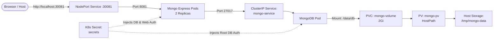

# MongoDB & Mongo Express on Kubernetes (Kind)

[](https://kubernetes.io/)
[](https://kind.sigs.k8s.io/)
[](https://www.mongodb.com/)
[](https://github.com/mongo-express/mongo-express)
[](https://github.com/masanthimanshu/kubernetes-mongodb)

A reproducible local Kubernetes environment deploying a persistent **MongoDB** instance paired with the **Mongo Express** web-based management UI using **Kind** (Kubernetes in Docker).

---

## Table of Contents

- [What the Project Does](#what-the-project-does)
- [Why the Project Is Useful](#why-the-project-is-useful)
- [Architecture Overview](#architecture-overview)
- [Repository Structure](#repository-structure)
- [Getting Started](#getting-started)
  - [Prerequisites](#prerequisites)
  - [Quickstart (Automated)](#quickstart-automated)
  - [Manual Step-by-Step Deployment](#manual-step-by-step-deployment)
- [Access & Credentials](#access--credentials)
- [Verification & Useful Commands](#verification--useful-commands)
- [Tearing Down](#tearing-down)
- [Where Users Can Get Help](#where-users-can-get-help)
- [Who Maintains and Contributes](#who-maintains-and-contributes)
  - [Maintainer](#maintainer)
  - [Contributing](#contributing)

---

## What the Project Does

This project provides an automated, production-styled declarative Kubernetes configuration for running MongoDB and Mongo Express locally using [Kind](https://kind.sigs.k8s.io/). It manages the complete lifecycle of:

1. **Kind Cluster Provisioning**: Creates a dedicated cluster named `mongo-cluster` configured with host port forwarding (`30081:30081`) and host path volume mounts (`/tmp/mongo-data`).
2. **Persistent Storage Management**: Provisions a local `PersistentVolume` (PV) and `PersistentVolumeClaim` (PVC) bound to host storage, ensuring database collections persist across pod recreation.
3. **MongoDB Deployment**: Runs MongoDB as a single-replica Deployment backed by persistent storage, secured through Kubernetes `Secret` credentials, and exposed internally via a `ClusterIP` Service (`mongo-service:27017`).
4. **Mongo Express UI Deployment**: Runs a 2-replica high-availability Mongo Express web admin portal communicating directly with the internal MongoDB Service.
5. **Host Ingress / NodePort Mapping**: Exposes Mongo Express via NodePort `30081`, mapped directly to `http://localhost:30081` on the host machine.
6. **One-Command Orchestration**: Provides [`run.sh`](run.sh) to idempotently spin up the cluster, apply manifests, and wait for rollouts to complete.

---

## Why the Project Is Useful

- **Zero Cloud Costs**: Test real multi-tier Kubernetes architectures locally without needing AWS EKS, GCP GKE, or Azure AKS.
- **Data Persistence Guaranteed**: Container restarts or recreations do not wipe data because MongoDB is attached to a host-backed PV at `/tmp/mongo-data`.
- **Infrastructure as Code (IaC) Standards**: Clean directory separation ([`k8s/app/`](k8s/app/), [`k8s/database/`](k8s/database/), [`k8s/volume/`](k8s/volume/)) mirrors enterprise Kubernetes repository layouts.
- **Security-First Configuration**: Passwords and usernames are decoupled into [`k8s/secrets.yaml`](k8s/secrets.yaml) and injected into container environments via `secretKeyRef`.
- **Turnkey Automation**: Eliminates manual debugging of cluster port mappings and startup timing with a robust rollout wait script.

---

## Architecture Overview



---

## Repository Structure

```text
.
├── k8s/
│   ├── app/
│   │   ├── mongo-express-app.yaml       # Deployment for Mongo Express (2 replicas)
│   │   └── mongo-express-service.yaml   # NodePort Service exposing port 30081
│   ├── database/
│   │   ├── mongo-app.yaml               # Deployment for MongoDB (1 replica, resources, volume)
│   │   └── mongo-service.yaml           # Internal ClusterIP Service (port 27017)
│   ├── volume/
│   │   ├── mongo-volume.yaml            # PersistentVolume mapped to /tmp/mongo-data
│   │   └── mongo-volume-claim.yaml      # PersistentVolumeClaim requesting 2Gi storage
│   ├── control-plane.yaml               # Kind cluster config (port mappings & extra mounts)
│   └── secrets.yaml                     # Kubernetes Secret for database and web credentials
├── run.sh                               # Automated bootstrap & verification bash script
└── README.md                            # Project documentation
```

### Manifest Links

- Cluster Configuration: [`k8s/control-plane.yaml`](k8s/control-plane.yaml)
- Credentials & Secrets: [`k8s/secrets.yaml`](k8s/secrets.yaml)
- Storage Configuration: [`k8s/volume/`](k8s/volume/) ([`mongo-volume.yaml`](k8s/volume/mongo-volume.yaml), [`mongo-volume-claim.yaml`](k8s/volume/mongo-volume-claim.yaml))
- Database Service & Workload: [`k8s/database/`](k8s/database/) ([`mongo-app.yaml`](k8s/database/mongo-app.yaml), [`mongo-service.yaml`](k8s/database/mongo-service.yaml))
- Mongo Express Application: [`k8s/app/`](k8s/app/) ([`mongo-express-app.yaml`](k8s/app/mongo-express-app.yaml), [`mongo-express-service.yaml`](k8s/app/mongo-express-service.yaml))
- Automated Bootstrap: [`run.sh`](run.sh)

---

## Getting Started

### Prerequisites

Ensure the following tools are installed and operational on your system:

- **Docker**: [Install Docker](https://docs.docker.com/get-docker/) (Docker daemon must be running)
- **Kind**: [Install Kind](https://kind.sigs.k8s.io/docs/user/quick-start/#installation) (`kind` CLI v0.20+)
- **kubectl**: [Install kubectl](https://kubernetes.io/docs/tasks/tools/)
- **Bash Shell**: macOS, Linux, or WSL2 on Windows

### Quickstart (Automated)

Clone the repository and run the setup script:

```bash
git clone https://github.com/masanthimanshu/kubernetes-mongodb.git
cd kubernetes-mongodb
chmod +x run.sh
./run.sh
```

The script will automatically:
1. Verify if the Kind cluster `mongo-cluster` exists; if not, create it using [`k8s/control-plane.yaml`](k8s/control-plane.yaml).
2. Apply the secrets, persistent storage, database, and web application manifests.
3. Wait for the MongoDB and Mongo Express pods to pass readiness checks (`kubectl rollout status`).
4. Output the URL to access the web UI.

Once complete, open **`http://localhost:30081`** in your browser.

---

### Manual Step-by-Step Deployment

To deploy each component individually:

#### 1. Create the Kind Cluster
```bash
kind create cluster --name mongo-cluster --config k8s/control-plane.yaml
```

#### 2. Apply Secrets
```bash
kubectl apply -f k8s/secrets.yaml
```

#### 3. Provision Persistent Storage (PV & PVC)
```bash
kubectl apply -f k8s/volume/
```

#### 4. Deploy MongoDB & Internal Service
```bash
kubectl apply -f k8s/database/
```

#### 5. Deploy Mongo Express & NodePort Service
```bash
kubectl apply -f k8s/app/
```

#### 6. Wait for Deployments to Become Ready
```bash
kubectl rollout status deployment/mongo-deployment --timeout=180s
kubectl rollout status deployment/mongo-express-deployment --timeout=180s
```

---

## Access & Credentials

When opening **`http://localhost:30081`**, your browser will request HTTP Basic Authentication.

| Component | Username | Password | Source File |
| :--- | :--- | :--- | :--- |
| **Mongo Express UI (HTTP Auth)** | `user` | `pass` | [`k8s/secrets.yaml`](k8s/secrets.yaml) (`web-*`) |
| **MongoDB Root Database** | `mongo-user` | `mongo-pass` | [`k8s/secrets.yaml`](k8s/secrets.yaml) (`mongo-root-*`) |

> **Security Note**: These default credentials are for local development and learning only. Do not use default credentials in shared or public environments.

---

## Verification & Useful Commands

Useful commands to inspect your cluster state:

```bash
# Check pod health and status
kubectl get pods -o wide

# Check services and port bindings
kubectl get svc

# Inspect PersistentVolume and Claim bindings
kubectl get pv,pvc

# Stream Mongo Express application logs
kubectl logs -l app=mongo-express --tail=50 -f

# Stream MongoDB logs
kubectl logs -l app=mongo --tail=50 -f

# Connect directly to MongoDB shell inside the pod
kubectl exec -it deployment/mongo-deployment -- mongosh -u mongo-user -p mongo-pass
```

---

## Tearing Down

### Option 1: Remove Kubernetes Workloads (Retain Cluster)
```bash
kubectl delete -f k8s/app/ -f k8s/database/ -f k8s/volume/ -f k8s/secrets.yaml
```

### Option 2: Destroy the Kind Cluster Entirely
```bash
kind delete cluster --name mongo-cluster
```

To clean up persistent database storage from your host machine:
```bash
rm -rf /tmp/mongo-data
```

---

## Where Users Can Get Help

If you run into issues or have questions:

- **Repository Issues**: Open a ticket on [GitHub Issues](https://github.com/masanthimanshu/kubernetes-mongodb/issues)
- **Kubernetes Documentation**: [kubernetes.io/docs](https://kubernetes.io/docs/)
- **Kind Documentation**: [kind.sigs.k8s.io](https://kind.sigs.k8s.io/)
- **Mongo Express Documentation**: [github.com/mongo-express/mongo-express](https://github.com/mongo-express/mongo-express)
- **MongoDB Docker Hub**: [hub.docker.com/_/mongo](https://hub.docker.com/_/mongo)

---

## Who Maintains and Contributes

### Maintainer

This project is maintained by:

- **Himanshu** ([@masanthimanshu](https://github.com/masanthimanshu))
- Email: [masanthimanshu@gmail.com](mailto:masanthimanshu@gmail.com)
- GitHub: [masanthimanshu/kubernetes-mongodb](https://github.com/masanthimanshu/kubernetes-mongodb)

### Contributing

Contributions, feedback, and suggestions are welcome! To contribute:

1. **Fork** the repository: [github.com/masanthimanshu/kubernetes-mongodb](https://github.com/masanthimanshu/kubernetes-mongodb)
2. **Create a branch** for your feature or bug fix:
   ```bash
   git checkout -b feature/your-feature-name
   ```
3. **Test your manifests**: Ensure the cluster deploys cleanly with `./run.sh` and pods become ready.
4. **Commit your changes**:
   ```bash
   git commit -m "feat: descriptive summary of your update"
   ```
5. **Push to your branch**:
   ```bash
   git push origin feature/your-feature-name
   ```
6. **Open a Pull Request** on [GitHub PRs](https://github.com/masanthimanshu/kubernetes-mongodb/pulls) explaining your changes.
